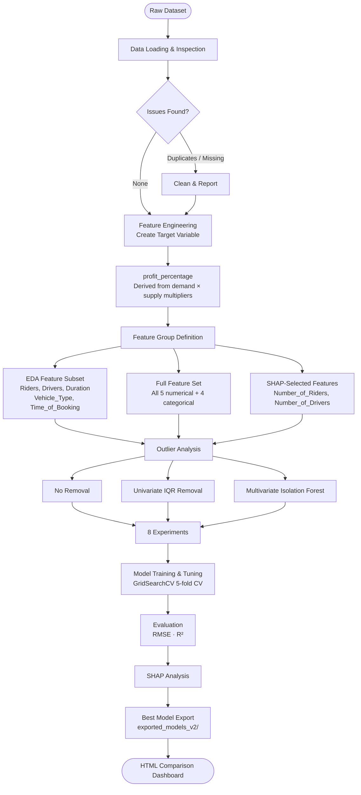
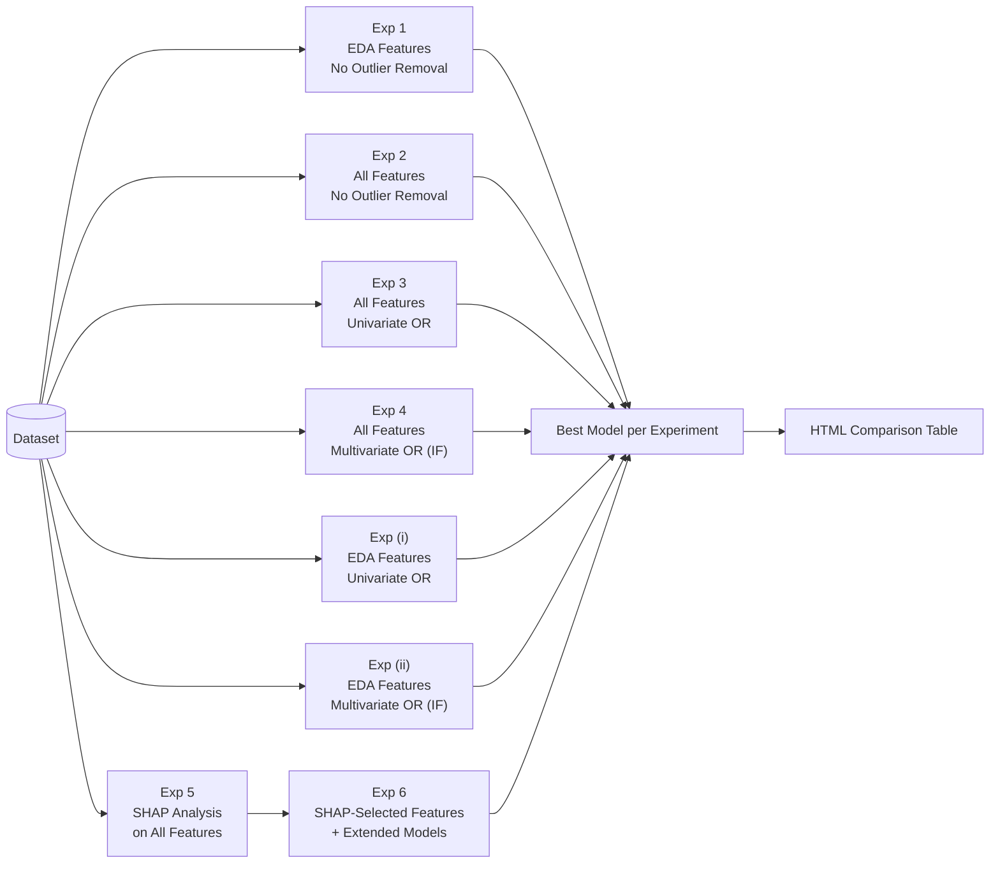
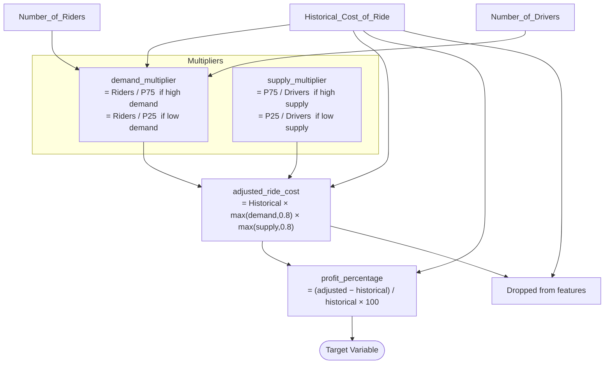
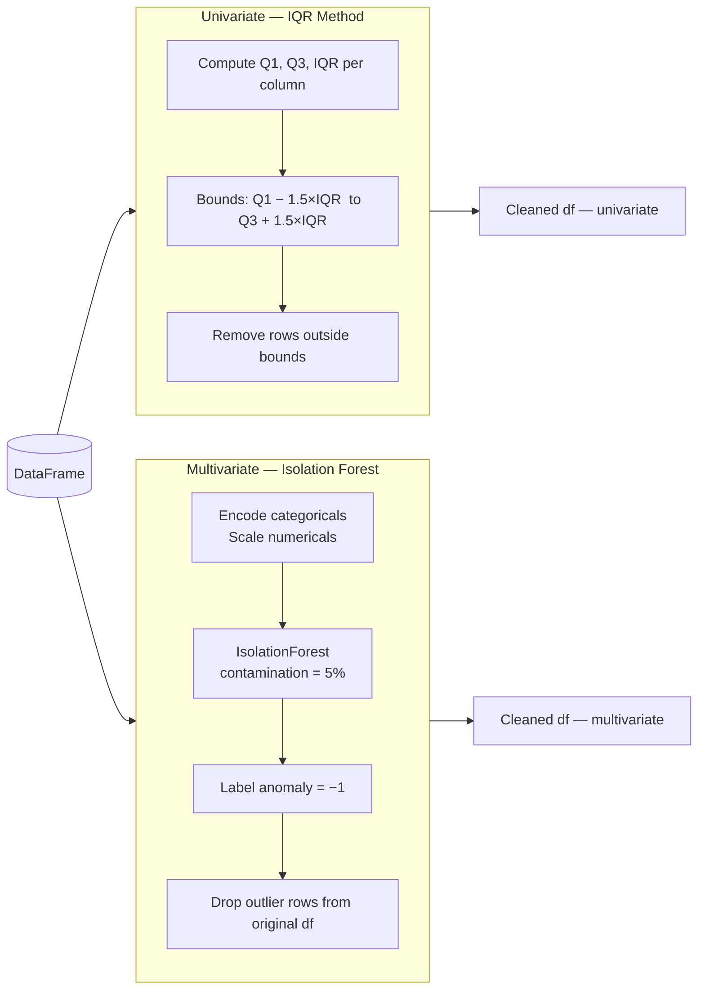
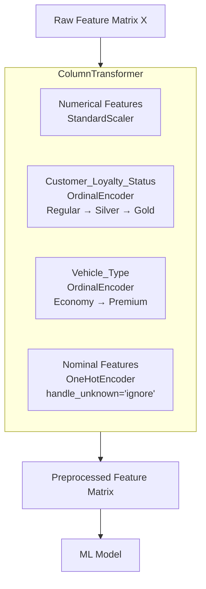
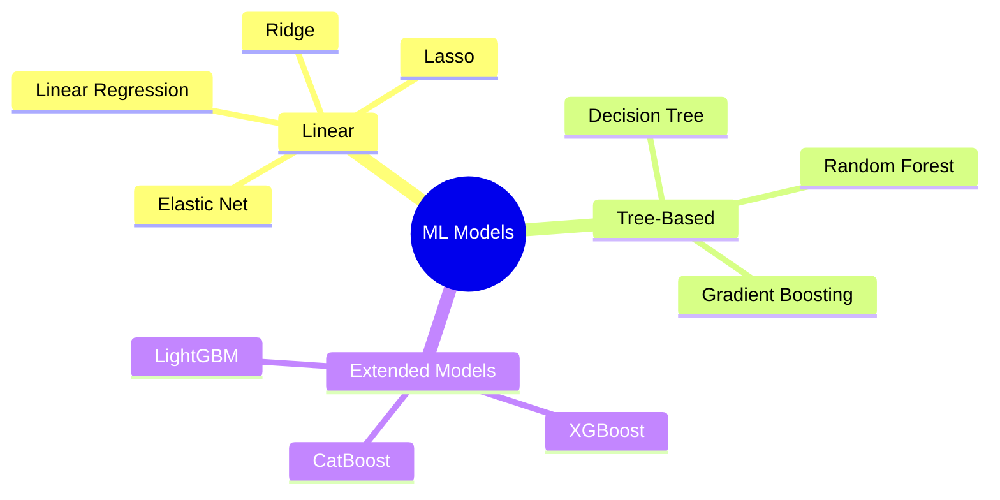
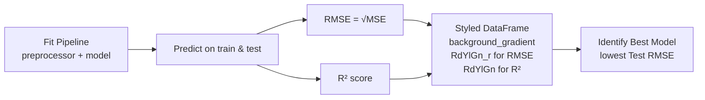
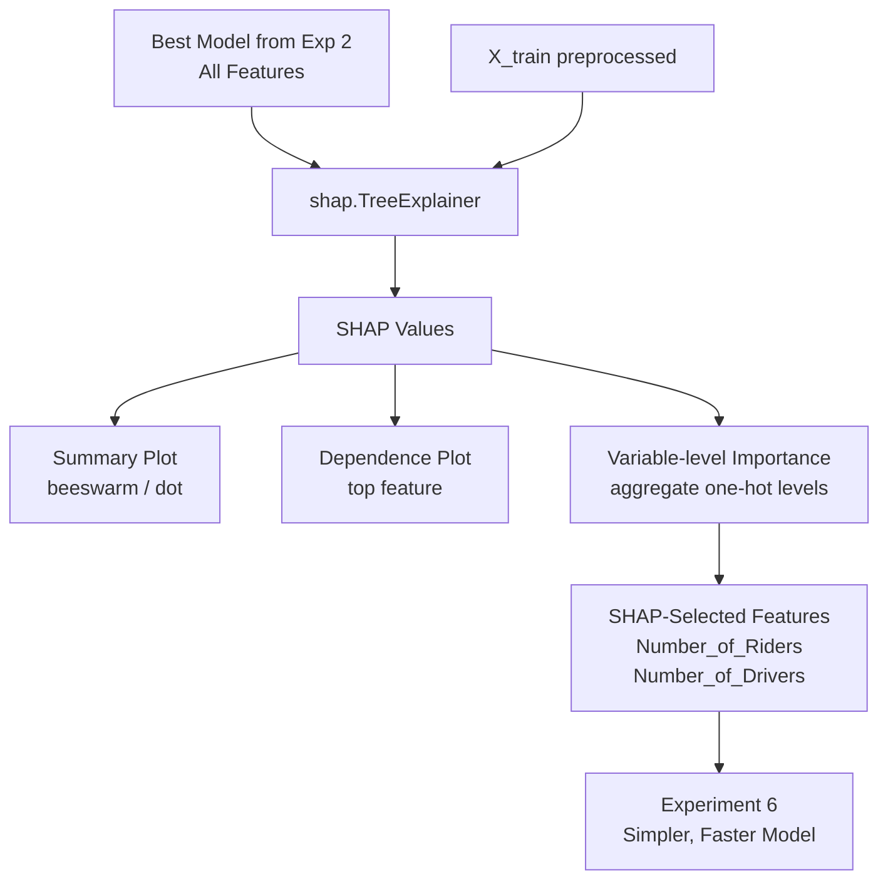

# Dynamic Surge Pricing — ML Modeling Pipeline

> Predicting **profit percentage** from ride-share demand/supply dynamics using a systematic, multi-experiment machine learning approach.

---

## Objective

Build a regression model that predicts the **profit percentage** a ride earns over its historical base cost, given real-time demand and supply conditions.

```
profit_percentage = (adjusted_ride_cost − historical_cost) / historical_cost × 100
```

---

## End-to-End Pipeline



---

## Experiments



| # | Experiment | Feature Set | Outlier Treatment | Extended Models |
|---|-----------|-------------|-------------------|:---:|
| 1 | EDA features | `Riders`, `Drivers`, `Duration`, `Vehicle_Type`, `Time_of_Booking` | None | — |
| 2 | All features | Full 5 numerical + 4 categorical | None | — |
| 3 | All features | Full set | Univariate (IQR) | — |
| 4 | All features | Full set | Multivariate (Isolation Forest) | — |
| 5 | SHAP analysis | Full set | None | — |
| 6 | SHAP-selected | `Number_of_Riders`, `Number_of_Drivers` | None | XGBoost, LightGBM, CatBoost |
| (i) | EDA features | EDA subset | Univariate (IQR) | — |
| (ii) | EDA features | EDA subset | Multivariate (Isolation Forest) | — |

---

## Feature Engineering



---

## Outlier Handling



> **Note:** Isolation Forest is tree-based — scaling has **no effect** on its results. Encoding categoricals is still required for the preprocessor.

---

## Preprocessing Pipeline



---

## Models Evaluated



**Tuning strategy:** `GridSearchCV` with 5-fold `KFold` cross-validation, optimised on **Mean Absolute Error (MAE)**.

---

## Evaluation & Comparison


---

## SHAP Analysis



---

## Key Results Summary

| Experiment | Expected behaviour |
|---|---|
| Exp 2 — All Features | Baseline: highest feature richness |
| Exp 3 / 4 — Outlier Removal | Better generalisation, possibly lower RMSE |
| Exp 5 — SHAP | Reveals top drivers of profit % |
| Exp 6 — SHAP features + extended | Simpler model; extended boosters often win |

> **All experiments share identical `train_test_split(test_size=0.2, random_state=0)` and `KFold(n_splits=5, random_state=42)` to ensure fair comparison.**

